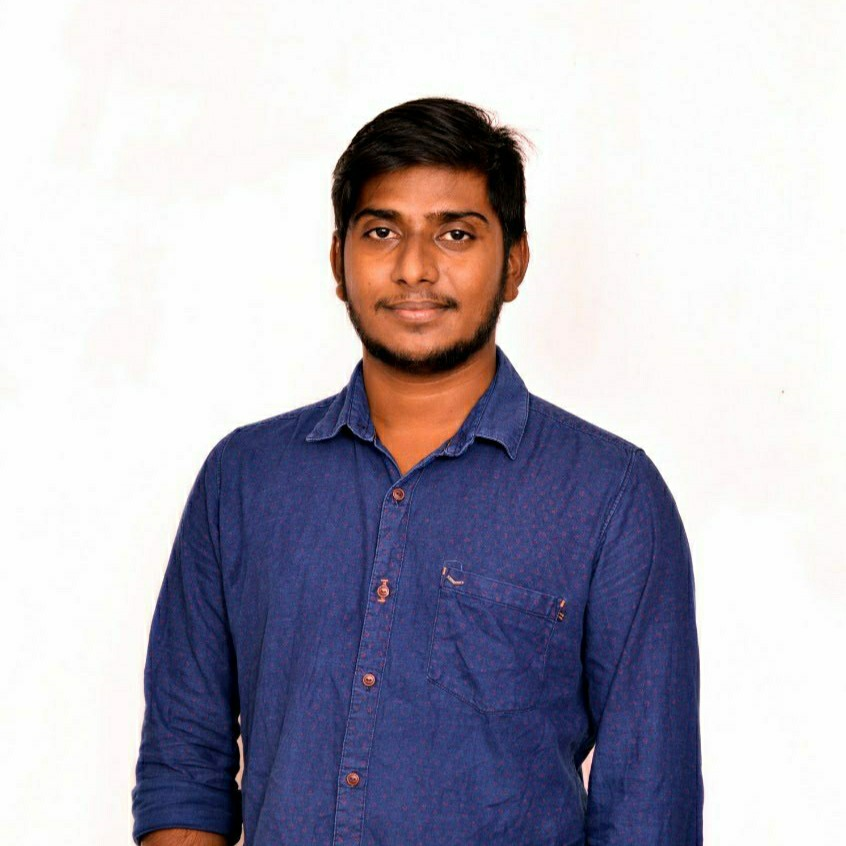

# Ramu Devarashetti

I am currently persuing M.S. Applied Computer Science Program in Northwest Missouri State. Prior to this, I have 3.6 years of relevant experience in the Information Technology Industry. I worked as a Project Engineer at Wipro Limited, Hyderabad, India and as a Software Engineer at Universal Electronics Inc, Bangalore, India.

